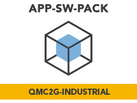

<p align="center">
	
</p>

<h1 align="center">i.MX RT INDUSTRIAL DRIVE DEVELOPMENT PLATFORM </h3>

This repository holds the Industrial Application for [i.MX RT Industrial Drive Development Platform](https://www.nxp.com/design/designs/i-mx-rt-industrial-drive-development-platform:I.MX-RT-INDUSTRIAL-DRIVE-DEV-PLATFORM) App SW Pack and depends on the MCUXpresso SDK overall delivery. 

## Resources 

* Purchase  [i.MX RT Industrial Drive Development Platform](https://www.nxp.com/design/designs/i-mx-rt-industrial-drive-development-platform:I.MX-RT-INDUSTRIAL-DRIVE-DEV-PLATFORM)
	* 1x ISI-QMC-DGC02. (Daughter Card) 
	* 1x ISI-QMC-DB02. (Digital Board) 
	* At least 1x ISI-QMC-PSB02 or 1x ISI-QMC-PSB02B. (Power Stage Board). Note that you can add up to four Power Stage Boards. 
* [AN13644 App Note](https://www.nxp.com/docs/en/application-note/AN13644.pdf): Getting started with i.MX RT Industrial Drive Development Platform – covers technical details for the bring up of the platform.
* Install [MCUXpresso IDE v11.6.0](https://www.nxp.com/design/software/development-software/mcuxpresso-software-and-tools-/mcuxpresso-integrated-development-environment-ide:MCUXpresso-IDE) or above. 
* Install [FreeMaster tool 3.1](https://www.nxp.com/design/software/development-software/freemaster-run-time-debugging-tool:FREEMASTER) or above. 
* [AN13643 App Note](https://www.nxp.com/docs/en/application-note/AN13643.pdf): i.MX RT Industrial Drive Development Platform software overview. Note: this App SW Pack covers limited set of features present in the software overview document, future App SW Pack releases will cover a complete set of features.
* [AN13642 App Note](https://www.nxp.com/docs/en/application-note/AN13642.pdf): i.MX RT Industrial Drive Development Platform hardware overview - covers hardware specifications of the boards.

## Assemble the Application
There are two options for installing this package into MCUXpresso:

* **Option 1:**
	Right-click in the "Installed SDKs" window in the MCUXpresso IDE and choose the "Import remote SDK Git repository" option. Fill the Repository box with ```https://github.com/nxp-mcuxpresso/appswpacks-qmc2g-industrial``` and the Revision box with ```mcux_release_github```.

* **Option 2:**
	You need to have both Git and [West](https://docs.zephyrproject.org/latest/develop/west/index.html) installed, then execute the commands below to gather the whole APP-SW-PACKS/QMC2G-INDUSTRIAL delivery at revision ```${revision}``` and place it in a folder named ```appswpacks_qmc2g_industrial```. 
	```
	west init -m https://github.com/nxp-mcuxpresso/appswpacks-qmc2g-industrial --mr ${revision} appswpacks_qmc2g_industrial
	cd appswpacks_qmc2g_industrial
	west update
	```
	Replace ```${revision}``` with any SDK revision you wish to achieve. This can be ```mcux_release_github``` if you want the latest state, or any commit SHA.

	Finally, drag-and-drop the appswpacks_qmc2g_industrial/ folder into the "Installed SDKs" window in the MCUXpresso IDE.

For more details about how to download and install the package in the MCUXpresso IDE, refer to [AN13644 - Getting Started](https://www.nxp.com/docs/en/application-note/AN13644.pdf).

For information about how to assemble the HW, please refer to [AN13644 - Getting Started](https://www.nxp.com/docs/en/application-note/AN13644.pdf) and [AN13642 - Hardware overview](https://www.nxp.com/docs/en/application-note/AN13642.pdf).
 
## Build and Run the Application
For detailed instructions on getting started with the software refer to Section 5 – Software Preparation in [AN13644 - Getting Started](https://www.nxp.com/docs/en/application-note/AN13644.pdf).

Any further questions regarding use of MCUXpresso IDE may be resolved in : [Run a project using MCUXpresso IDE](https://github.com/nxp-mcuxpresso/mcux-sdk/blob/main/docs/run_a_project_using_mcux.md).

To find more information about the SW itself, have a look at [AN13643 - Software overview](https://www.nxp.com/docs/en/application-note/AN13643.pdf).

To run the application:
1. Build both the CM4 and CM7 projects with the same target (Release or Debug).
2. Start the debug session for the CM7 project first. For CM7, use the pre-configured launch files included in the project or re-configure the IDE-generated launch files to the same settings as the pre-configured ones. (Right-click on the launch file and go to Debug As.)
3. Place a breakpoint at the line ```ui32ClkADC = CLOCK_GetFreqFromObs(CCM_OBS_ADC1_CLK_ROOT);``` in **main_cm7.c**
4. Run the CM7 application until the breakpoint.
5. Keep the CM7 debug session **open** and start the CM4 debug session **at the same time**.
6. Run the CM4 application.
7. Run the CM7 application.

If you want to see the debug output of the application, you can open two serial terminals - one of them for the CM4 and the other for the CM7 project.

If you want to control the application through FreeMASTER, please close the CM4 serial terminal first. You can find the pre-configured FreeMASTER project in the **freemaster_exe/** directory. If anything doesn't work, double check the project settings and the path to the AXF file.

You can change the configuration of the application through **source/qmc_features_config.h**. For example, if you're only using 2 motors, connect your 2 PSBs to the connectors for PSB1 and PSB2 and configure the **MC_MAX_MOTORS** macro to the value 2.

## Application Overview 
The i.MX RT Industrial Drive Development Platform software package consists of a reference demo application and API that demonstrate how to take advantage of i.MX RT Industrial Drive Development Platform hardware capabilities to develop a secure, robust and reliable multi-motor control system which meets the requirements, standards and best practices required by commercial industrial products. This significantly reduces the effort required to develop multi-motor control applications and the time-to-market of the product. This document provides an overview of the i.MX RT Industrial Drive Development Platform software package. 

You can find a complete overview of the HW and SW components, including those not released version v1.0 in: [AN13643 - Software overview](https://www.nxp.com/docs/en/application-note/AN13643.pdf) and [AN13642 - Hardware overview](https://www.nxp.com/docs/en/application-note/AN13642.pdf).

**The current App SW Pack for the i.MX RT Industrial Drive development platform covers the below set of features:**
* Motor control. 
* Fault handling. 
* TSN connectivity. 
* Data Logging without encryption. 
* Board Service – Temperature and Gate Driver status monitoring
* Local Service - GUI and display handling

Future App SW Pack releases will include the remaining features covered by [AN13643 - Software overview](https://www.nxp.com/docs/en/application-note/AN13643.pdf). 

## Other Reference Applications 
For other rapid-development software bundles please visit the [Application Software Packs](https://www.nxp.com/appswpack). 

For SDK examples please go to the [MCUXpresso SDK](https://github.com/nxp-mcuxpresso/mcux-sdk/) and get the full delivery to be able to build and run examples that are based on other SDK components. 