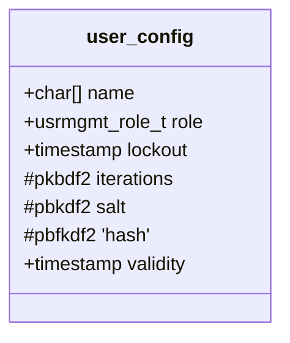
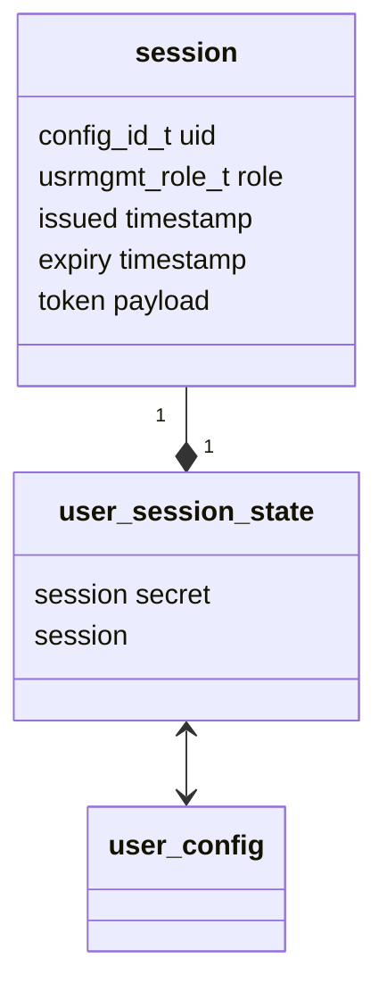
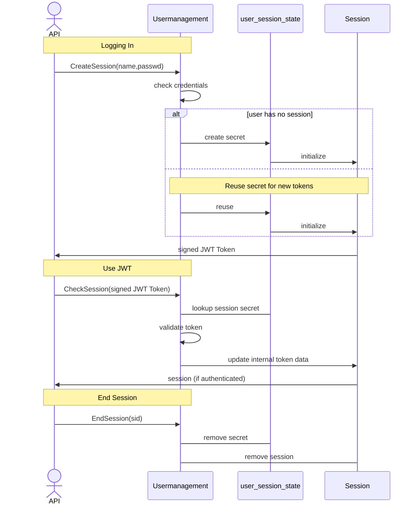

## Usermanagement API

### Account storage



Users are stored in the qmc configuration as binary data. As this configuration contains secrets, the configuration web API is not exposing these options.

Authentication is done by hashing the user's passphrase and combining the hash with `pbkdf2(hash,salt,iterations)` to generate the authentication secret stored in the configuration.

### Session management



A session is represented by the session struct, which is encoded in a JWT token.

the session object is available from the Usermanagement API,

the user_session_state is used internally only to associate a session secret.

the session secret in a random key for `hmac_sha256` which is used as the signature for the JWT tokens.

a session can produce multiple tokens, which prolong the time the session can be used.



if a session is closed it's secret is removed, which invalidates all tokens from this session.

* the lifetime of a session is incremented with each new token
* tokens have a limited lifetime


## Account Management

* accounts have a timestamp associated that invalidate them
  * superuser accounts can log in with invalidated credentials, in order to prevent lockout of all users.
* updating an account password extends the account validity period
* accounts have a lockout timestamp, and are considered deactivated if the timestamp is in the future
  * invalid authentication does lock an account immediately
  * if the system is not restarted locked accounts have some configurable tries (currently 5) to unlock during the lockout period.

* Users can update their passphrase
  * Depending on the size of an configuration item, and the configured secret length old password hashes for an user secret are kept, and reusing those passwords will be rejected. (currently 5).
  * Passphrases must contain specific character classes
  * Passphrase classification is done using constant-time comparisons to avoid leaking information about a new or rejected passphrase.

```c
/*
 * minimal passphrase length
 */
#define USRMGMT_MIN_PASSPHRASE_LENGTH 10

/* Character classification classes:
 * UPPERCASE LOWERCASE NUMBERS SPECIAL CONTROL NON_ASCII
 *
 * set required and rejected character classes as requirement for the
 * user's passphrase
 */
#define USRMGMT_PASSPHRASE_REQUIRED_CLASSESS() UPPERCASE LOWERCASE NUMBERS
#define USRMGMT_PASSPHRASE_REJECTED_CLASSESS() CONTROL

/* User Lockout duration after unsuccessful authentication attempts
 * in seconds
 */
#define USRMGMT_LOCKOUT_DURATION 300

/* Session duration limit
 * in seconds
 */
#define USRMGMT_SESSION_DURATION (60*60*2)

/* Passphrase validity duration limit
 * in seconds
 */
#define USRMGMT_PASSPHRASE_DURATION (60*60*24*60)

/* Number of attempts a locked account has to unlock until the lock is enforced.
 * Accounts get locked immediately after the first authentication failure.
 * If the system stays on, they have this amount of attempts to unlock.
 * during the lockout period without waiting.
 */
#define USRMGMT_AUTHENTICATION_ATTEMPTS 5


```

